# Guía Funcional — Europamundo PDF to WordPress Pipeline

> **Gina Travel — Paquetes Europa**
> Sistema automatizado de publicación de circuitos turísticos
> Versión 1.0 — Marzo 2026

---

## 1. Visión General

Este sistema transforma catálogos PDF de **Europamundo Vacaciones** en páginas web publicadas automáticamente en WordPress, con mapa interactivo, contenido SEO optimizado e imágenes de portada.


### El problema que resuelve

| Antes (manual) | Después (automatizado) |
|---|---|
| Copiar datos del PDF uno por uno | Un comando procesa todo el catálogo |
| Crear página en WordPress manualmente | Páginas se publican automáticamente |
| Buscar y subir imágenes manualmente | Imágenes se obtienen de Pexels automáticamente |
| SEO básico o inexistente | SEO 79/100 generado por IA |
| Mapa como imagen estática | Mapa interactivo con navegación por días |
| ~2 horas por circuito | ~30 segundos por circuito |

---

## 2. Arquitectura del Pipeline

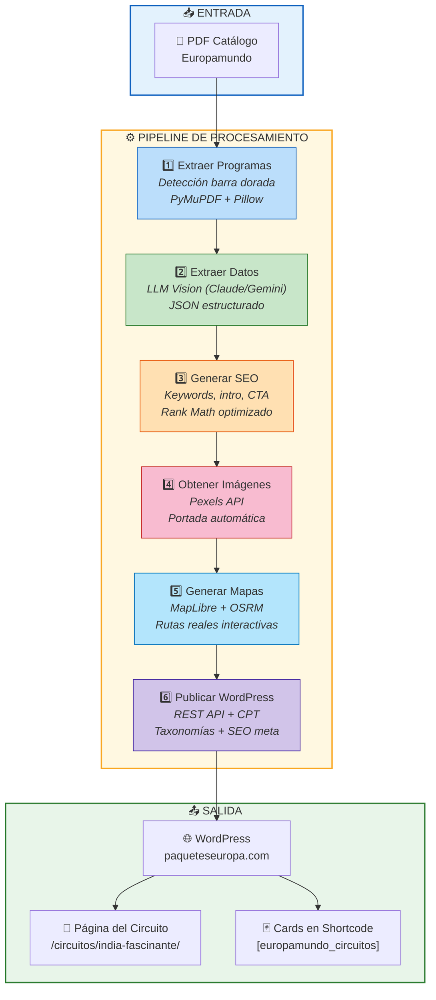

---

## 3. Detalle de cada Etapa

### Etapa 1 — Extraer Programas del PDF

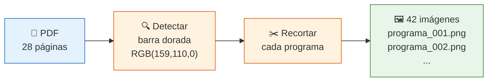

**¿Qué hace?** Lee el PDF página por página, detecta la barra dorada "Fechas de Salida" como separador visual, y recorta cada programa como imagen individual.

**Tecnología:** PyMuPDF (renderizado), NumPy (detección color), Pillow (recorte)

---

### Etapa 2 — Extraer Datos con IA

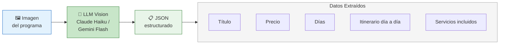

**¿Qué hace?** Envía cada imagen a un modelo de IA con visión que lee todos los datos del programa y los estructura en JSON.

**Proveedores soportados:**

| Provider | Modelo | Costo/programa | Config |
|---|---|---|---|
| Claude | Haiku 4.5 | ~$0.008 | `LLM_PROVIDER=claude` |
| Gemini | Flash 2.5 | ~$0.002 | `LLM_PROVIDER=gemini` |

---

### Etapa 3 — Generar Contenido SEO

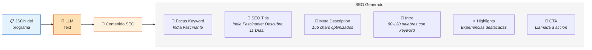

**Score SEO alcanzado:** 79/100 en Rank Math (de 11/100 sin SEO)

**Optimizaciones automáticas:**
- Keyword en título, URL, meta description, contenido, headings
- Power words y sentiment words en el título
- Links internos y externos (dofollow)
- Keyword density óptima

---

### Etapa 4 — Obtener Imágenes

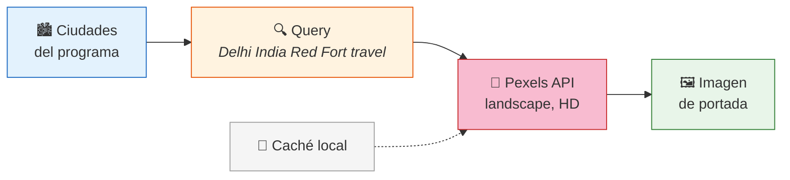

**¿Qué hace?** Busca una imagen profesional de la primera ciudad del circuito en Pexels (gratuito, sin atribución obligatoria). Usa caché para no repetir búsquedas.

---

### Etapa 5 — Generar Mapa Interactivo

```mermaid
flowchart LR
    CITIES["🏙️ Ciudades"] --> GEO["📍 Geocodificar<br/>Nominatim"]
    GEO --> ROUTE["🛣️ Calcular Rutas<br/>OSRM (carretera)<br/>Great Circle (vuelo)"]
    ROUTE --> MAP["🗺️ HTML<br/>MapLibre GL JS"]

    subgraph MAP_FEATURES["Funcionalidades del Mapa"]
        direction TB
        M1["📍 Marcadores con noches"]
        M2["🛣️ Rutas por carretera real"]
        M3["✈️ Arcos de vuelo"]
        M4["📅 Navegación por días"]
        M5["📋 Panel de información"]
        M6["🍽️ Chips almuerzo/cena/vuelo"]
    end

    MAP --> MAP_FEATURES

    style CITIES fill:#e3f2fd,stroke:#1565c0
    style GEO fill:#b3e5fc,stroke:#0277bd
    style ROUTE fill:#b3e5fc,stroke:#0277bd
    style MAP fill:#e8f5e9,stroke:#2e7d32
    style MAP_FEATURES fill:#f5f5f5,stroke:#9e9e9e
```

**Componente self-contained:** El mapa se genera como HTML embebible que funciona sin servidor adicional. Los datos (coordenadas, rutas, itinerario) están inlineados como variables JavaScript.

---

### Etapa 6 — Publicar en WordPress

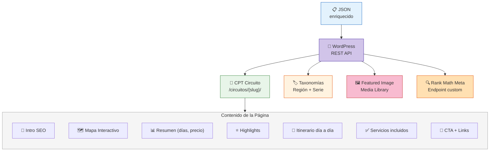

---

## 4. Estructura de WordPress

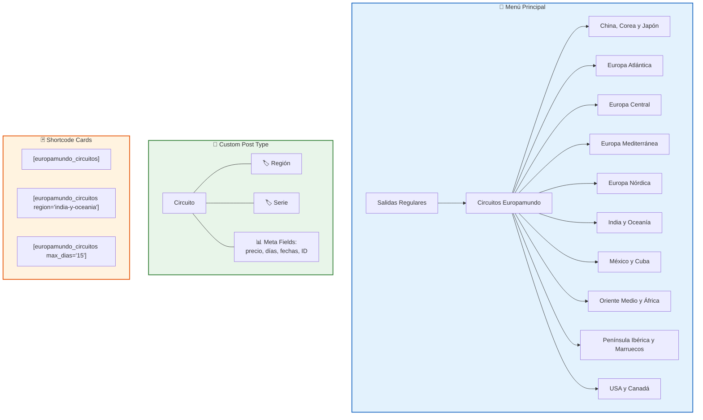

---

## 5. Pasos de Uso — Guía del Operador

### Primera vez (setup)

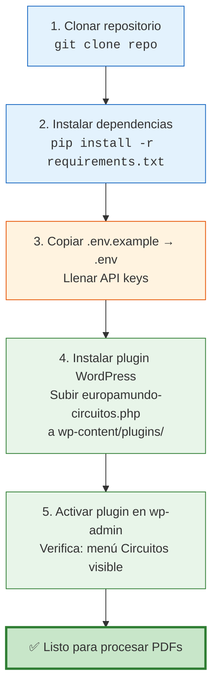

### Procesar un nuevo catálogo PDF

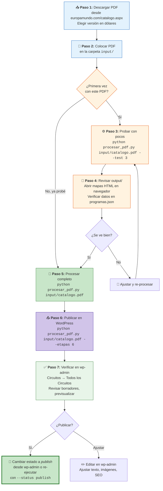

### Paso a paso detallado

| # | Acción | Comando / Ubicación | Resultado |
|---|---|---|---|
| 1 | **Descargar PDF** | europamundo.com/catalogo.aspx → versión dólares | `usa-canada-2025-2027.pdf` |
| 2 | **Colocar en input/** | Copiar PDF a `input/` | `input/usa-canada-2025-2027.pdf` |
| 3 | **Probar (opcional)** | `python procesar_pdf.py input/usa-canada-2025-2027.pdf --test 3` | 3 programas procesados |
| 4 | **Revisar output** | Abrir `output/usa-canada-2025-2027/maps/*.html` en navegador | Mapas interactivos visibles |
| 5 | **Procesar completo** | `python procesar_pdf.py input/usa-canada-2025-2027.pdf` | ~42 programas procesados |
| 6 | **Publicar** | `python procesar_pdf.py input/usa-canada-2025-2027.pdf --etapas 6` | Circuitos como borradores en WP |
| 7 | **Verificar** | wp-admin → Circuitos → filtrar por región "USA y Canadá" | Revisar contenido y SEO |
| 8 | **Aprobar** | Cambiar estado a "Publicado" en wp-admin | Páginas live en el sitio |

### Después de procesar

- El PDF se **mueve automáticamente** a `input/procesados/`
- Los datos quedan en `output/{nombre-pdf}/programas.json`
- Los mapas HTML quedan en `output/{nombre-pdf}/maps/`
- El caché de geocoding y imágenes se comparte entre ejecuciones

### Procesamiento por lotes (todos los catálogos)

```bash
# Descargar todos los PDFs a input/
# Luego ejecutar uno por uno:

python procesar_pdf.py input/usa-canada-2025-2027.pdf --etapas 1,2,3,4,5,6
python procesar_pdf.py input/mexico-cuba-2025-2027.pdf --etapas 1,2,3,4,5,6
python procesar_pdf.py input/china-japon-y-corea-2025-2027.pdf --etapas 1,2,3,4,5,6
python procesar_pdf.py input/sudeste-india-y-oceania-2025-2027.pdf --etapas 1,2,3,4,5,6
python procesar_pdf.py input/oriente-medio-africa-2025-2027.pdf --etapas 1,2,3,4,5,6
python procesar_pdf.py input/peninsula-2025-2027.pdf --etapas 1,2,3,4,5,6
python procesar_pdf.py input/mediterranea-2025-2027.pdf --etapas 1,2,3,4,5,6
python procesar_pdf.py input/atlantica-2025-2027.pdf --etapas 1,2,3,4,5,6
python procesar_pdf.py input/nordica-2025-2027.pdf --etapas 1,2,3,4,5,6
python procesar_pdf.py input/central-2025-2027.pdf --etapas 1,2,3,4,5,6
```

### Troubleshooting

| Problema | Causa | Solución |
|---|---|---|
| "No se encontró el archivo" | PDF no está en input/ | Verificar ruta |
| "Error de autenticación" | API key inválida o WP credentials | Revisar .env |
| Ciudad no geocodificada | Nombre con typo del OCR | Se omite automáticamente, no bloquea |
| OSRM falla | Servicio público caído | Usa línea recta como fallback |
| JSON malformado (Gemini) | Gemini a veces corta respuestas | Cambiar a `LLM_PROVIDER=claude` |
| SEO score bajo | Keywords no coinciden con slug | Regenerar SEO con etapa 3 |
| Menú WP sin texto | Caché del navegador | Ctrl+Shift+R para limpiar |

---

## 6. Flujo Técnico Detallado

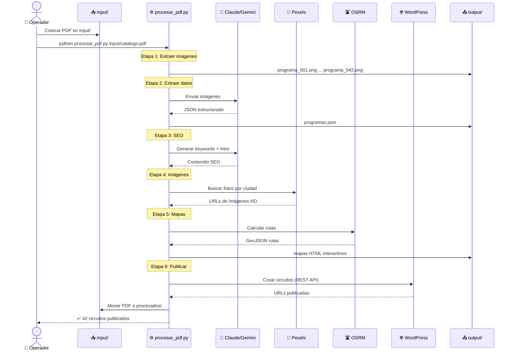

---

## 6. Estructura del Proyecto

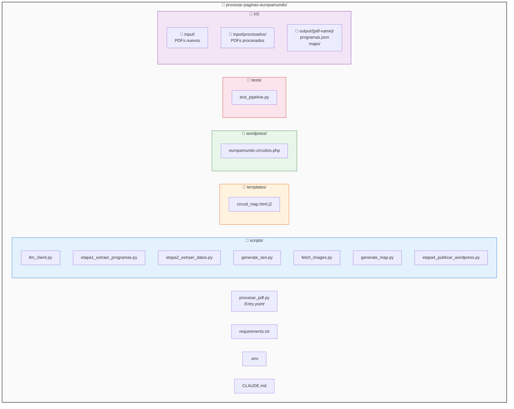

---

## 7. Costos Operativos

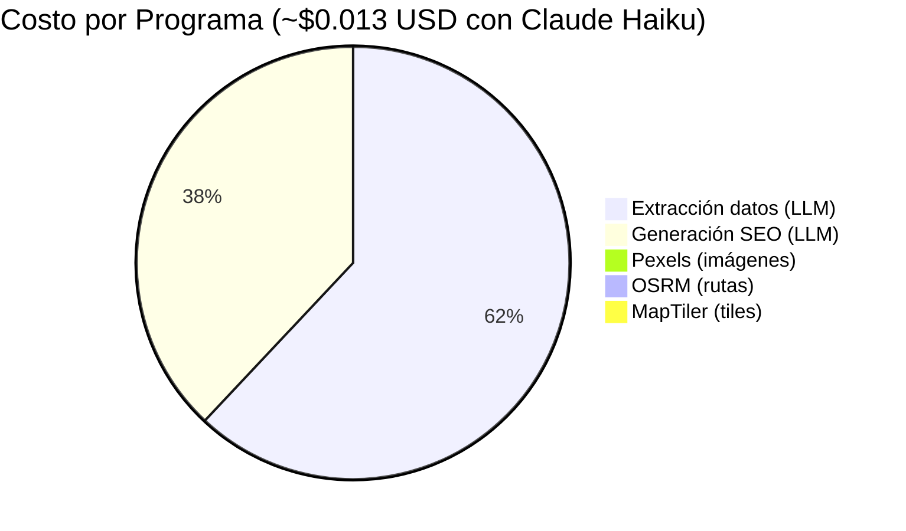

| Escenario | Claude Haiku | Gemini Flash |
|---|---|---|
| 1 PDF (~42 programas) | **$0.55** | **$0.13** |
| 5 PDFs (~250 programas) | **$3.25** | **$0.75** |
| Todos los catálogos (~800) | **$10.40** | **$2.40** |

---

## 8. Comandos de Referencia

```bash
# ══════════════════════════════════════════
# PROCESAMIENTO
# ══════════════════════════════════════════

# Pipeline completo (sin publicar)
python procesar_pdf.py input/catalogo.pdf

# Pipeline completo + publicar en WordPress
python procesar_pdf.py input/catalogo.pdf --etapas 1,2,3,4,5,6

# Publicar como publicado (no borrador)
python procesar_pdf.py input/catalogo.pdf --etapas 1,2,3,4,5,6 --status publish

# Solo procesar 3 programas (prueba)
python procesar_pdf.py input/catalogo.pdf --test 3

# Solo publicar (ya procesado antes)
python procesar_pdf.py input/catalogo.pdf --etapas 6

# ══════════════════════════════════════════
# TESTS
# ══════════════════════════════════════════

# Tests de regresión
python tests/test_pipeline.py

# ══════════════════════════════════════════
# CONFIGURACIÓN
# ══════════════════════════════════════════

# Cambiar a Gemini (más barato)
# En .env: LLM_PROVIDER=gemini

# Cambiar a Claude (más confiable)
# En .env: LLM_PROVIDER=claude
```

---

## 9. Requisitos

### Software
- Python 3.11+
- WordPress 6.x con plugin `europamundo-circuitos.php` activo

### APIs (gratuitas o de bajo costo)
- **Anthropic** o **Google AI Studio** — Para extracción y SEO
- **Pexels** — Imágenes (gratis, ilimitado)
- **MapTiler** — Tiles de mapa (gratis hasta 100K/mes)
- **OSRM** — Rutas por carretera (gratis, público)
- **Nominatim** — Geocodificación (gratis, fair use)

### WordPress Plugins
- Rank Math SEO (Free)
- Elementor (Free) — para páginas landing
- Plugin custom: `europamundo-circuitos.php`

---

> **Desarrollado con** Claude Code + Claude Opus 4.6
> **Para** Gina Travel — Paquetes Europa
> **Marzo 2026**
